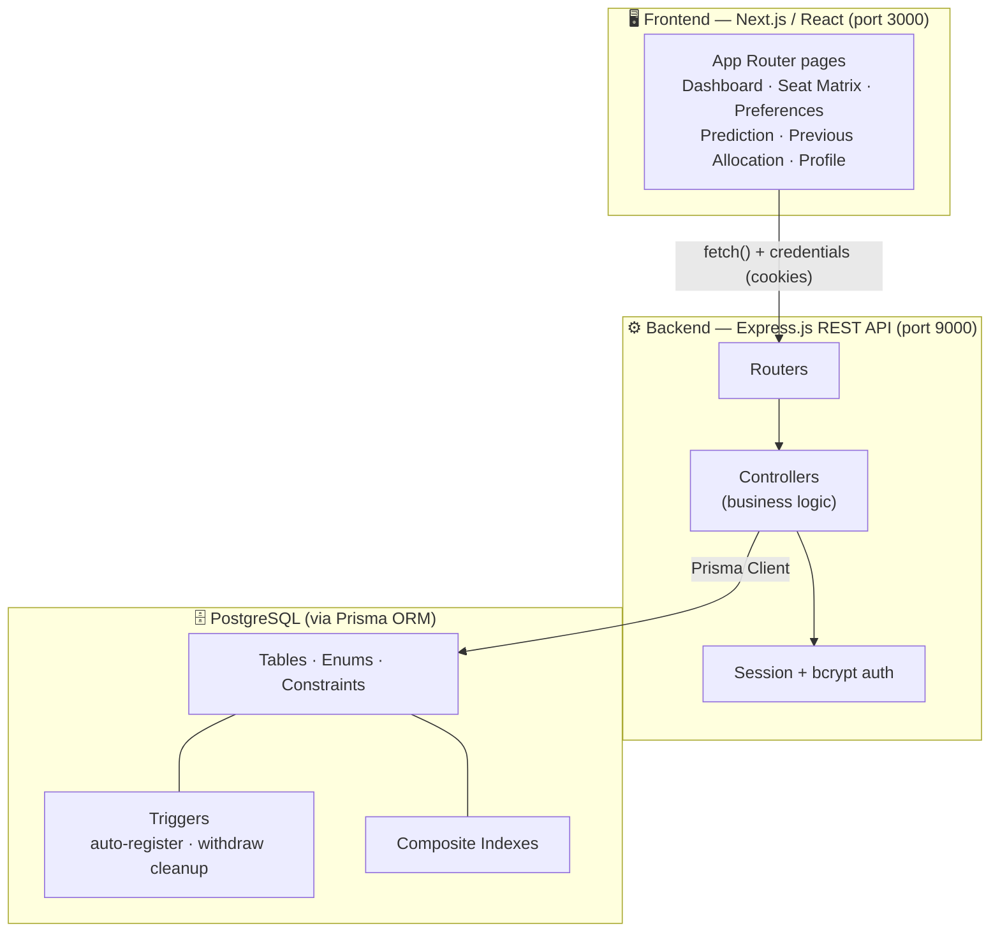
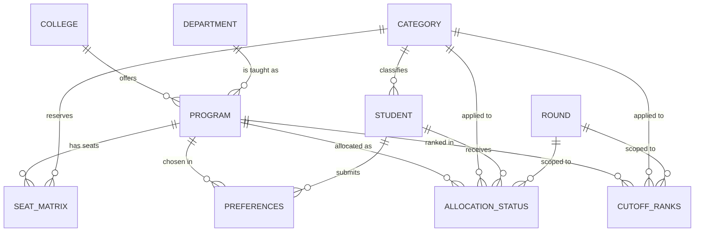

# College Allocation Database Management System

> A full‑stack, rank‑based **college seat allocation engine** that models the real‑world counselling process used by large‑scale admission systems — complete with multi‑round allocation, reservation categories, float/freeze/withdraw lifecycle, historical cut‑off tracking, and a data‑driven admission predictor.


---

## Table of Contents

- [Why This Project Stands Out](#why-this-project-stands-out)
- [Tech Stack](#tech-stack)
- [System Architecture](#system-architecture)
- [Feature Walkthrough](#feature-walkthrough)
- [Database Design](#database-design)
- [Engineering Highlights](#engineering-highlights)
- [Core Algorithms](#core-algorithms)
- [API Reference](#api-reference)
- [Project Structure](#project-structure)
- [Getting Started](#getting-started)
- [Environment Variables](#environment-variables)
- [Data Seeding](#data-seeding)
- [Security Notes](#security-notes)
- [Roadmap](#roadmap)

---

## Why This Project Stands Out

This isn't a CRUD demo. It implements the genuinely hard parts of an admissions platform:

- **A real allocation algorithm** — eligible students are greedily matched to their highest feasible preference across **general and reserved category seats**, mirroring how counselling bodies (JoSAA/KCET‑style) actually allocate seats.
- **Database‑level business logic** — two **PostgreSQL triggers** (auto‑registration on first password set, and cascade cleanup on withdrawal) enforce invariants that survive even if the application layer is bypassed.
- **Transaction‑safe bulk writes** — allocations are committed in **batched Prisma transactions (500 rows/batch)** so a 100k‑student run is atomic and fast.
- **Performance‑aware design** — the seat matrix is loaded into an in‑memory `Map` for **O(1) seat availability checks**, backed by **composite indexes** on the hot preference‑lookup path.
- **Stateful, secure auth** — session‑cookie authentication with **bcrypt** hashing and a passwordless first‑login flow (mobile number → hashed credential).
- **Clean separation of concerns** — a decoupled Express REST API and a Next.js App‑Router frontend that talks to it through a single, environment‑driven base URL.

---

## Tech Stack


| Layer        | Technology                                                    | Notes                                                      |
| ------------ | ------------------------------------------------------------- | ---------------------------------------------------------- |
| **Frontend** | Next.js 15.5 (App Router) + React 19                          | Client components, file‑based routing, Turbopack dev/build |
| **UI**       | Tailwind CSS v4, shadcn/ui, Radix UI primitives, lucide‑react | Accessible, composable component system                    |
| **Backend**  | Express.js 5.1 on Node.js (ES Modules)                        | REST API, modular router/controller architecture           |
| **ORM**      | Prisma 6.17                                                   | Type‑safe queries, migrations, transactions                |
| **Database** | PostgreSQL (Neon serverless)                                  | Triggers, composite indexes, enums, constraints            |
| **Auth**     | express‑session + bcryptjs                                    | Cookie‑based sessions, hashed passwords                    |
| **Tooling**  | nodemon, csv‑parser, dotenv, ESLint                           | Dev reload, CSV bulk import, config, linting               |


---

## System Architecture

A classic **three‑tier architecture** with a stateless‑per‑request API and a stateful session store.




**Request flow:** the browser calls the API with `credentials: "include"` so the session cookie travels with every request. CORS is locked to the frontend origin, and the API base URL is injected via `NEXT_PUBLIC_API_BASE_URL` so the same build runs against local, staging, or production backends without code changes.

---

## Feature Walkthrough


| Feature                   | Description                                                                                                                                              |
| ------------------------- | -------------------------------------------------------------------------------------------------------------------------------------------------------- |
| **Authentication**        | Session login; first‑time users authenticate with their mobile number, which is hashed and stored, auto‑promoting them to *registered* via a DB trigger. |
| **Student Dashboard**     | Shows current round, latest allocation, and live float/freeze/withdraw status with confirm dialogs.                                                      |
| **Preference Management** | Ordered, reorderable college+department preference list with create/update and "no changes after allocation starts" guardrails.                          |
| **Seat Matrix Explorer**  | Filter available seats by institute, department, and category (with "All" aggregations).                                                                 |
| **Previous Allocation**   | Browse historical **opening/closing cut‑off ranks** per program, category, and round.                                                                    |
| **Admission Predictor**   | Estimates reachable programs by comparing the student's general/category rank against previous‑year cut‑offs.                                            |
| **Allocation Lifecycle**  | Students can **Float**, **Freeze**, or **Withdraw**; withdrawal cascades to remove allocations automatically.                                            |
| **Profile & Security**    | View profile and change password (bcrypt‑hashed).                                                                                                        |


---

## Database Design

The schema models **10 core entities** with fully normalized relationships. A `Program` is the central join of a `College` and a `Department`; seats, preferences, allocations, and cut‑offs all hang off it.




**Key modeling decisions**

- **Composite primary keys** where they reflect real identity — e.g. `Seat_Matrix(program_id, category_id)` and `Allocation_Status(student_id, program_id, category_id, round_id)` — preventing duplicate seats/allocations at the schema level.
- **Enums** for `gender`, `status` (`float | freeze | withdrawn`), and `rankType` (`general | category`) to keep invalid states unrepresentable.
- `**BigInt` ranks** to comfortably handle nationwide rank ranges.
- **Composite + single indexes** on `Preferences(student_id, preference_number)` and `Preferences(student_id)` — the exact access patterns hit hardest during allocation.

### Database Triggers (PL/pgSQL)


| Trigger                                 | Timing                       | Purpose                                                                                                                                                        |
| --------------------------------------- | ---------------------------- | -------------------------------------------------------------------------------------------------------------------------------------------------------------- |
| `trigger_auto_set_registered`           | `BEFORE UPDATE` on `Student` | Sets `isRegistered = true` automatically the first time a password is set — but only when the password actually changes, so manual flag updates are preserved. |
| `trigger_cleanup_withdrawn_allocations` | `AFTER UPDATE` on `Student`  | When a student's status flips to `withdrawn`, all of their `Allocation_Status` rows are deleted, preventing orphaned allocations.                              |


Pushing these rules into the database guarantees consistency regardless of which service mutates the data.

---

## Engineering Highlights

These are the decisions worth a closer look in a code review:

1. **In‑memory seat matrix for O(1) availability.** Before allocation begins, the entire seat matrix is hydrated into a `Map` keyed by ``${program_id}_${category_id}``. Each allocation decision is a constant‑time read/decrement instead of a database round‑trip.
2. **Batched, atomic bulk inserts.** Allocations are accumulated in memory, then flushed inside a single `prisma.$transaction` in **500‑row batches** with `skipDuplicates`, balancing throughput against transaction size.
3. **Frozen‑seat reconciliation.** Seats already locked by *frozen* students are decremented up front, so re‑running a round never double‑allocates a held seat.
4. **Atomic multi‑update status simulation.** The float‑status updater composes multiple `updateMany` operations into one transaction so partial state can never leak.
5. **CSV‑driven bulk seeding.** Students and seat matrices import from CSV via streaming `csv-parser` in **100‑row batches**, suitable for large datasets.
6. **Audit‑grade logging.** The allocation engine writes timestamped, per‑decision entries (with stack traces on failure) to `allocation_logs.txt` for full traceability.
7. **Environment‑driven API base URL.** The frontend reads `NEXT_PUBLIC_API_BASE_URL` from a single module, so there are zero hard‑coded hostnames across the codebase.

---

## Core Algorithms

### Seat Allocation (rank‑based, preference‑ordered, category‑aware)

```text
1.  Load the seat matrix into an in‑memory Map  → O(1) availability lookups
2.  Fetch all eligible students (registered, status = "float")
3.  Decrement seats already held by frozen students
4.  For each eligible student:
      for each preference (in preference order):
          if a GENERAL seat is open  → allocate using general_rank, stop
          else if a CATEGORY seat is open → allocate using category_rank, stop
5.  Commit all allocations in batched transactions (500/batch)
6.  Compute cut‑offs: min(rank)=opening, max(rank)=closing per (program, category)
7.  Persist cut‑off ranks for the round
```

The two‑tier check (general first, then reserved category) reflects real counselling rules where a reserved‑category student is preferentially placed against an open seat before consuming a reserved one.

### Admission Prediction

```text
1.  Read the logged‑in student's ranks and category
2.  Expand college/department filters (empty filter → all)
3.  Query historical cut‑offs where closing_rank ≥ student's general OR category rank
4.  Restrict to the previous year's rounds
5.  Return the reachable programs with their opening/closing ranks
```

---

## API Reference

All authenticated routes rely on the session cookie (`credentials: "include"`). Base URL defaults to `http://localhost:9000`.

### Auth & Profile


| Method | Endpoint               | Description                                    |
| ------ | ---------------------- | ---------------------------------------------- |
| `POST` | `/api/login`           | Log in / first‑time register via mobile number |
| `POST` | `/api/logout`          | Destroy session and clear cookie               |
| `GET`  | `/api/profile`         | Get the logged‑in student's profile            |
| `POST` | `/api/change-password` | Change password (bcrypt)                       |


### Student


| Method | Endpoint                        | Description                                |
| ------ | ------------------------------- | ------------------------------------------ |
| `GET`  | `/student/getCurrentAllocation` | Current float/freeze/withdraw status       |
| `POST` | `/student/getAllocationDetails` | Per‑round allocation history               |
| `POST` | `/student/changeStatus`         | Change lifecycle status                    |
| `POST` | `/student/getPrediction`        | Predict reachable programs                 |
| `GET`  | `/student/add`                  | Bulk import students from CSV (admin/seed) |


### Preferences


| Method | Endpoint               | Description                     |
| ------ | ---------------------- | ------------------------------- |
| `POST` | `/preference/add`      | Create / update preference list |
| `GET`  | `/preference/self/:id` | Fetch a student's preferences   |


### Seat Matrix & Reference Data


| Method | Endpoint                                             | Description                                   |
| ------ | ---------------------------------------------------- | --------------------------------------------- |
| `POST` | `/seatMatrix/data`                                   | Seats filtered by college/department/category |
| `GET`  | `/seatMatrix/add`                                    | Bulk import seat matrix from CSV              |
| `GET`  | `/college/all` · `/department/all` · `/category/all` | Dropdown reference data                       |


### Allocation Engine


| Method | Endpoint                                     | Description                                |
| ------ | -------------------------------------------- | ------------------------------------------ |
| `GET`  | `/allocation/start-allocation?roundNumber=N` | Run allocation for a round                 |
| `POST` | `/allocation/get-opening-and-closing-ranks`  | Historical cut‑offs by filters             |
| `GET`  | `/allocation/fetch-round-number`             | Current active round                       |
| `POST` | `/allocation/update-float-status`            | Simulate float→freeze/withdraw transitions |


---

## Project Structure

```
College-Allocation-Database-Managment-System/
├── src/                          # Next.js frontend (App Router)
│   ├── app/
│   │   ├── page.js               # Landing page
│   │   ├── login/                # Login route
│   │   ├── seat-matrix/          # Public seat matrix explorer
│   │   └── student/              # Authenticated portal
│   │       ├── page.jsx          # Dashboard
│   │       ├── preference/       # Manage preferences
│   │       ├── prediction/       # Admission predictor
│   │       ├── previous-allocation/
│   │       ├── seatmatrix/
│   │       └── profile/
│   ├── components/               # Sidebar, login form, shadcn/ui
│   └── lib/api.js                # Single source of the API base URL
│
├── backend/                      # Express.js REST API
│   ├── index.js                  # App entry, middleware, route mounting
│   ├── routes/                   # One router per domain
│   ├── controllers/              # Business logic (allocation, prediction, …)
│   └── prisma/
│       ├── schema.prisma         # Data model
│       └── migrations/           # Schema history incl. trigger migrations
│
├── .env.local                    # Frontend env (API base URL)
└── README.md
```

---

## Getting Started

### Prerequisites

- **Node.js** 18+ (ES Modules)
- **PostgreSQL** database (local, or a hosted provider such as Neon)

### 1. Backend (API)

```bash
cd backend
npm install

# create backend/.env (see Environment Variables below), then:
npx prisma generate           # generate the Prisma client
npx prisma migrate deploy     # apply schema + triggers + indexes

npm run dev                   # starts the API on http://localhost:9000
```

### 2. Frontend (Web)

```bash
# from the project root
npm install
npm run dev                   # starts Next.js on http://localhost:3000
```

Open **[http://localhost:3000](http://localhost:3000)**.

---

## Environment Variables

### Frontend — `.env.local` (project root)

```env
# Base URL of the Express backend (must be NEXT_PUBLIC_ to reach the browser)
NEXT_PUBLIC_API_BASE_URL=http://localhost:9000
```

### Backend — `backend/.env`

```env
DATABASE_URL="postgresql://<user>:<password>@<host>/<db>?sslmode=require"
PORT=9000
SESSION_SECRET="<a-long-random-secret>"
```

> Generate a strong session secret, e.g. `node -e "console.log(require('crypto').randomBytes(32).toString('hex'))"`.

---

## Data Seeding

The backend can bulk‑load datasets from CSV files placed alongside the controllers:

- `backend/controllers/students.csv` → imported via `GET /student/add`
- `backend/controllers/seat_details.csv` → imported via `GET /seatMatrix/add`

Both import in 100‑row batches with `skipDuplicates`, so re‑running is safe.

---

## Security Notes

- **Rotate committed credentials.** `backend/.env` currently contains a real database URL and session secret. Rotate the database password, generate a fresh `SESSION_SECRET`, and **untrack the file** (`git rm --cached backend/.env`) — it should never be in version control. Add `.env` and `.env.local` to `.gitignore`.
- **Production hardening checklist:** set session `cookie.secure = true` behind HTTPS, scope CORS to the deployed frontend origin, and put privileged routes (CSV import, `start-allocation`, `update-float-status`) behind admin authorization.

---

---

*Built to demonstrate end‑to‑end product engineering: data modeling, algorithms, transactional integrity, and a polished, accessible UI.*